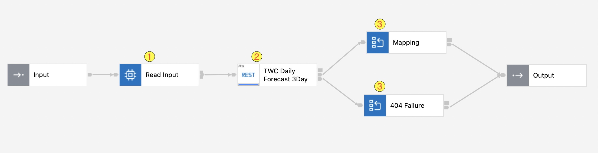
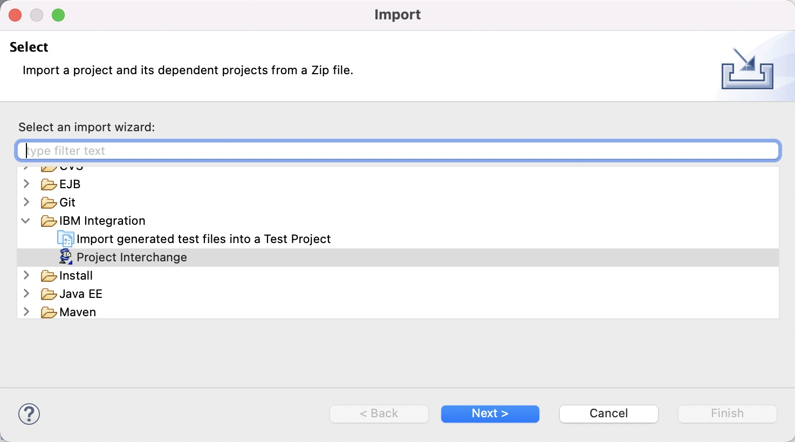

# OpenAPI 3.0 in IBM App Connect Enterprise (ACE)

API developers have been using Swagger 2.0 spec to define APIs over past few years. Later it has been donated to Linux Foundation and named as Open API specification and a new Swagger spec was released with lots of new features and improvements as Open API Specifications (OAS) 3.0.

OpenAPI 3.0 support was introduced in ACE Toolkit V12.0.1.0 and [enhanced](https://www.ibm.com/docs/en/app-connect/12.0?topic=wniv1-new-function-added-in-version-120-subsequent-modification-fix-packs#v12010__restapi) in V12.0.3.0. This means that developers can now:

* Consume a REST API defined in an OpenAPI 3.0
* Build (create from scracth or implement using an existing definition) a REST API in OpenAPI 3.0 format

## Overview

This sample ACE project utilizes [The Weather Company (TWC)](https://www.ibm.com/products/environmental-intelligence-suite/data-packages) API. Specifically, we will use [Daily Forecast](https://app.swaggerhub.com/apis/WAWX-SUN/daily-forecast_api_2/3.0) API. Therefore, obtaining an API Key is necassary.

For the purpose of demonstrating the different capablities of ACE, we will not only consume the Daily Forecast API but we will also create a wrapper on the top of it to simplify the request and response according to our needs. The same objective can be acheived using [GraphQL proxy API](https://www.ibm.com/docs/en/api-connect/10.0.x?topic=definition-creating-graphql-proxy-api) in API Connect.

ACE (formerly known as IBM Integration Bus or IIB) supplies built-in nodes that we can use to define our message flows.The following nodes will be used:

1. Compute Node (ESQL) to transform request
2. RESTRequest Node to consume Daily Forecast API
3. Mapping Nodes to transform response (Graphically)




## Implementation Details

The Daily Forecast API documentation can be found [here](https://ibm.co/V3DFap). It accepts different URL constructs but we will use **Request by Postal Key** construct which requires the following parameters: postalKey, units, language, format, apiKey.

The table below describes full usage of the API call (GET with Query String)

**URL Path Components**

| **URL Part** | <div style="width:140px">**URL Part Type**</div> | **Description** |
| --- | --- | --- |
| hostname | Host Name | **api.weather.com** is the host for these API's |
| version | Path Part | Current API version  (example:  "v3") |
| product  | Path Part | Product name (example: "wx/forecast/daily/3day") |
| apiKey | Query Parameter | Your API key for accessing the API |
| format | Query Parameter | The format of the response ("json") |
| postalKey | Query Parameter | For API's which require a location for the data, the postalCode is the first three characters of the Postal Code followed by a colon then Country Code (ex. L5R:CA) |
| language | Query Parameter | Language to return the response in (ex. en-US, es, es-MX, fr-FR) |
| units | Query Parameter | The unit of measure for the response. The following values are supported: <br> e = English units, m = Metric units, h = Hybrid units (UK), s  = Metric SI units |

 **So, the final URL that will be invoked is:**
> `https://api.weather.com/v3/wx/forecast/daily/3day?postalKey=L5R:CA&units=m&language=en-US&format=json&apiKey=yourApiKey`


Basically, our subflow (which implements our created REST API) will accept one input only, namely postalCode as Query Parameter and hardcode the other values (country code, units, format, and language). This is acheived through Compute Node and RESTRequest Node.


| In this sample, country code will be set to 'CA' for Canada       |
|:------------------------|

For the API response, graphical transformation through Mapping Nodes will be used:

<details><summary>Original Response</summary>
<p>

#### Original response from Daily Forecast API (before transformation)

```json
{
   "calendarDayTemperatureMax":[
      12,
      10,
      -2,
      -2
   ],
   "calendarDayTemperatureMin":[
      -4,
      -3,
      -10,
      -11
   ],
   "dayOfWeek":[
      "Wednesday",
      "Thursday",
      "Friday",
      "Saturday"
   ],
   "expirationTimeUtc":[
      1645070127,
      1645070127,
      1645070127,
      1645070127
   ],
   "moonPhase":[
      "Full Moon",
      "Waning Gibbous",
      "Waning Gibbous",
      "Waning Gibbous"
   ],
   "moonPhaseCode":[
      "F",
      "WNG",
      "WNG",
      "WNG"
   ],
   "moonPhaseDay":[
      15,
      16,
      17,
      18
   ],
   "moonriseTimeLocal":[
      "2022-02-16T17:49:25-0500",
      "2022-02-17T18:58:24-0500",
      "2022-02-18T20:07:35-0500",
      "2022-02-19T21:17:03-0500"
   ],
   "moonriseTimeUtc":[
      1645051765,
      1645142304,
      1645232855,
      1645323423
   ],
   "moonsetTimeLocal":[
      "2022-02-16T07:41:04-0500",
      "2022-02-17T08:07:00-0500",
      "2022-02-18T08:30:09-0500",
      "2022-02-19T08:51:44-0500"
   ],
   "moonsetTimeUtc":[
      1645015264,
      1645103220,
      1645191009,
      1645278704
   ],
   "narrative":[
      "Cloudy with rain. Low 8C.",
      "Mix of rain and snow. Highs 9 to 11C and lows -11 to -9C.",
      "Partly cloudy. Highs -7 to -5C and lows -10 to -8C.",
      "Windy with times of sun and clouds. Highs -4 to -2C and lows -12 to -10C."
   ],
   "qpf":[
      12.45,
      28.76,
      1.08,
      0.0
   ],
   "qpfSnow":[
      0.0,
      18.4,
      1.1,
      0.0
   ],
   "sunriseTimeLocal":[
      "2022-02-16T07:15:15-0500",
      "2022-02-17T07:13:47-0500",
      "2022-02-18T07:12:19-0500",
      "2022-02-19T07:10:49-0500"
   ],
   "sunriseTimeUtc":[
      1645013715,
      1645100027,
      1645186339,
      1645272649
   ],
   "sunsetTimeLocal":[
      "2022-02-16T17:50:16-0500",
      "2022-02-17T17:51:37-0500",
      "2022-02-18T17:52:58-0500",
      "2022-02-19T17:54:19-0500"
   ],
   "sunsetTimeUtc":[
      1645051816,
      1645138297,
      1645224778,
      1645311259
   ],
   "temperatureMax":[
      null,
      10,
      -6,
      -3
   ],
   "temperatureMin":[
      8,
      -10,
      -9,
      -11
   ],
   "validTimeLocal":[
      "2022-02-16T07:00:00-0500",
      "2022-02-17T07:00:00-0500",
      "2022-02-18T07:00:00-0500",
      "2022-02-19T07:00:00-0500"
   ],
   "validTimeUtc":[
      1645012800,
      1645099200,
      1645185600,
      1645272000
   ],
   "daypart":[
      {
         "cloudCover":[
            null,
            99,
            100,
            91,
            51,
            83,
            56,
            51
         ],
         "dayOrNight":[
            null,
            "N",
            "D",
            "N",
            "D",
            "N",
            "D",
            "N"
         ],
         "daypartName":[
            null,
            "Tonight",
            "Tomorrow",
            "Tomorrow night",
            "Friday",
            "Friday night",
            "Saturday",
            "Saturday night"
         ],
         "iconCode":[
            null,
            12,
            5,
            16,
            30,
            46,
            24,
            29
         ],
         "iconCodeExtend":[
            null,
            1200,
            500,
            1600,
            3000,
            7810,
            3010,
            2900
         ],
         "narrative":[
            null,
            "Cloudy with periods of rain. Low 8C. Winds SW at 15 to 30 km/h. Chance of rain 100%. Rainfall around 12mm.  Winds could occasionally gust over 65 km/h.",
            "Rain with some snow mixing in in the afternoon. Some sleet or freezing rain possible. Morning high of 10C with temps falling to 0 to 2. Winds NW at 15 to 30 km/h. Chance of rain 100%. 3-7cm of snow expected.",
            "Snow in the evening will become lighter overnight. Low near -10C. Winds NNW at 25 to 40 km/h. Chance of snow 100%. Snow accumulating 12-20cm.",
            "Partly cloudy. High -6C. Winds WNW at 15 to 30 km/h.",
            "Becoming windy with snow showers later at night. Low -9C. Winds SW at 30 to 50 km/h. Chance of snow 80%. Snow accumulations less than 2cm.  Winds could occasionally gust over 65 km/h.",
            "Partly cloudy and windy. High -3C. Winds WNW at 30 to 50 km/h.  Winds could occasionally gust over 65 km/h.",
            "Partly to mostly cloudy. Low -11C. Winds WSW at 15 to 30 km/h."
         ],
         "precipChance":[
            null,
            100,
            100,
            100,
            7,
            76,
            12,
            10
         ],
         "precipType":[
            null,
            "rain",
            "rain",
            "snow",
            "snow",
            "snow",
            "precip",
            "snow"
         ],
         "qpf":[
            null,
            12.45,
            14.73,
            14.04,
            0.0,
            1.08,
            0.0,
            0.0
         ],
         "qpfSnow":[
            null,
            0.0,
            4.4,
            14.0,
            0.0,
            1.1,
            0.0,
            0.0
         ],
         "qualifierCode":[
            null,
            "Q1021",
            "Q7646",
            null,
            null,
            "Q1021",
            "Q1021",
            null
         ],
         "qualifierPhrase":[
            null,
            "Winds could occasionally gust over 65 km/h.",
            "Some sleet or freezing rain possible.",
            null,
            null,
            "Winds could occasionally gust over 65 km/h.",
            "Winds could occasionally gust over 65 km/h.",
            null
         ],
         "relativeHumidity":[
            null,
            75,
            83,
            78,
            59,
            72,
            59,
            70
         ],
         "snowRange":[
            null,
            "",
            "3-7",
            "12-20",
            "",
            "< 2",
            "",
            ""
         ],
         "temperature":[
            null,
            8,
            10,
            -10,
            -6,
            -9,
            -3,
            -11
         ],
         "temperatureHeatIndex":[
            null,
            9,
            9,
            0,
            -6,
            -2,
            -4,
            -7
         ],
         "temperatureWindChill":[
            null,
            6,
            -5,
            -16,
            -17,
            -15,
            -16,
            -17
         ],
         "thunderCategory":[
            null,
            "No thunder",
            "No thunder",
            "No thunder",
            "No thunder",
            "No thunder",
            "No thunder",
            "No thunder"
         ],
         "thunderIndex":[
            null,
            0,
            0,
            0,
            0,
            0,
            0,
            0
         ],
         "uvDescription":[
            null,
            "Low",
            "Low",
            "Low",
            "Low",
            "Low",
            "Low",
            "Low"
         ],
         "uvIndex":[
            null,
            0,
            1,
            0,
            2,
            0,
            2,
            0
         ],
         "windDirection":[
            null,
            219,
            318,
            343,
            289,
            223,
            283,
            243
         ],
         "windDirectionCardinal":[
            null,
            "SW",
            "NW",
            "NNW",
            "WNW",
            "SW",
            "WNW",
            "WSW"
         ],
         "windPhrase":[
            null,
            "Winds SW at 15 to 30 km/h.",
            "Winds NW at 15 to 30 km/h.",
            "Winds NNW at 25 to 40 km/h.",
            "Winds WNW at 15 to 30 km/h.",
            "Winds SW at 30 to 50 km/h.",
            "Winds WNW at 30 to 50 km/h.",
            "Winds WSW at 15 to 30 km/h."
         ],
         "windSpeed":[
            null,
            27,
            24,
            30,
            23,
            35,
            41,
            22
         ],
         "wxPhraseLong":[
            null,
            "Rain",
            "Rain/Snow",
            "Snow",
            "Partly Cloudy",
            "Snow Showers/Wind Late",
            "Partly Cloudy/Wind",
            "Partly Cloudy"
         ],
         "wxPhraseShort":[
            null,
            "Rain",
            "Rain/Snow",
            "Snow",
            "P Cloudy",
            "Snow Showers",
            "P Cldy/Wind",
            "P Cloudy"
         ]
      }
   ]
}
```
</p>
</details>

<details><summary>New Response</summary>
<p>

#### New response after transformation

```json
{
  "narrative": "Rain and snow. Highs 9 to 11C and lows -11 to -9C.",
  "temperature": {
    "high": 10,
    "low": -10
  }
}
```
</p>
</details>

## Creating the Project


1. Open your App Connect Enterprise Toolkit.
2. In the Workspace Launcher window, choose the workspace ~/IBM/ACET11/workspace/ace-openapi3-sample. Click OK.
3. The toolkit opens the project. Import the [TomorrowsWeather.zip](/project/TomorrowsWeather.zip) file found in this repo. Select File->Import->Project Interchange and click Next.



## Try It!

To be able to test our newly created API using **Try It** capability in Integration Server Web UI, we must uncomment and set the following parameters in **server.conf.yaml** configuration file of our Integration Server we are deploying to.

```
  HTTPConnector:
    CORSEnabled: true           # Set the value to true to make the listener respond to valid HTTP CORS requests
    CORSAllowOrigins: '*'
    CORSAllowCredentials: false
    CORSExposeHeaders: 'Content-Type'
    CORSMaxAge: -1
    CORSAllowMethods: 'GET,HEAD,POST,PUT,PATCH,DELETE,OPTIONS'
    CORSAllowHeaders: 'Accept,Accept-Language,Content-Language,Content-Type,Authorization'
```

